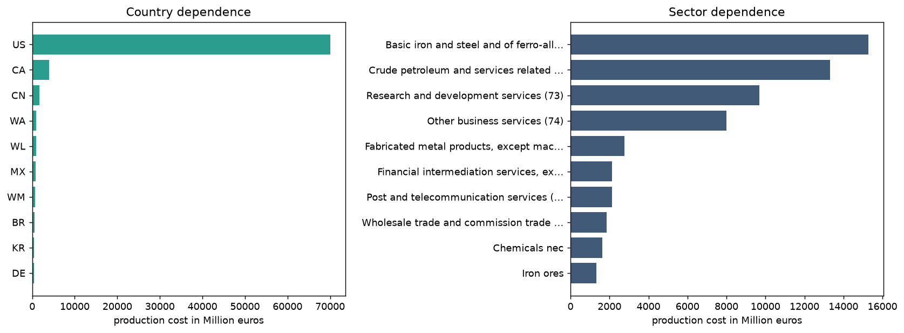

# Chokepoint

> ⚠️ **This project was never completed.** See [Limitations](#limitations) for why. Feel free to reach out for more information.

## Table of Contents

- [Chokepoint](#chokepoint)
  - [Table of Contents](#table-of-contents)
  - [Introduction](#introduction)
  - [Why this approach doesn't scale](#why-this-approach-doesnt-scale)
  - [Setup](#setup)
  - [Analysis](#analysis)

## Introduction

A small Django project for analyzing a company's sectoral dependencies using SEC and EXIOBASE data.

The goal was to compute the full (direct + indirect) upstream sectoral dependencies of a company, then aggregate them to analyze portfolios. Note that it's adding upstream costs, 

The intended workflow:

- Get revenue by activity segment, as close as possible to production revenue and excluding taxes
- Get non-current assets, ideally PPE (property, plant and equipment)
- Redistribute revenue across non-current assets to reallocate it to the country of production
- Map SEC segments to EXIOBASE sectors
- Use EXIOBASE to compute the Leontief inverse matrix and derive upstream sectoral dependencies per country
- Aggregate this at portfolio level and surface the top country and sector dependencies

## Why this approach doesn't scale

While building this project I made several findings that ultimately ended it. Some could have been worked around, others could not.

The list runs from the most critical issues to the least.

- The model does not work for service or fabless companies, since the location of production is unknown
- Many companies do not report a geographical breakdown of non-current assets
- Revenue by segment is often not reported
- The IO system relies on [EXIOBASE 3](https://exiobase.eu/about-exiobase/), which is released under a non-commercial license
- Coverage is limited to companies filing with the [SEC](https://www.sec.gov/), so mostly US-listed issuers
- For a company operating across several industries and countries, the redistribution step introduces bias into the IO results

## Setup

Set up the database from scratch and load the minimal dataset:

```bash
python -m venv .venv
source .venv/bin/activate
pip install -r requirements.txt
python manage.py setup_db --reset-db
```

## Analysis

Analyze a company by CIK:

```bash
python manage.py analyse_company 1045810
python manage.py analyse_company 1045810 --output dependence.png
```

The command accepts either a 10-digit CIK or a shorter numeric value, and generates a dependency chart for that company.

Example of Nvidia analysis:
> **Reading the chart:** each bar is a *total* upstream requirement, 
> not a share of a total. 
>
> Values overlap by construction — the 
> semiconductor bar already contains the plastics used to make those 
> semiconductors, which also appear in the plastics bar.
>
> **Do not sum the bars.** The sum exceeds the company's actual 
> spending, often by a large factor. Compare bars against each other, 
> never against the total.
